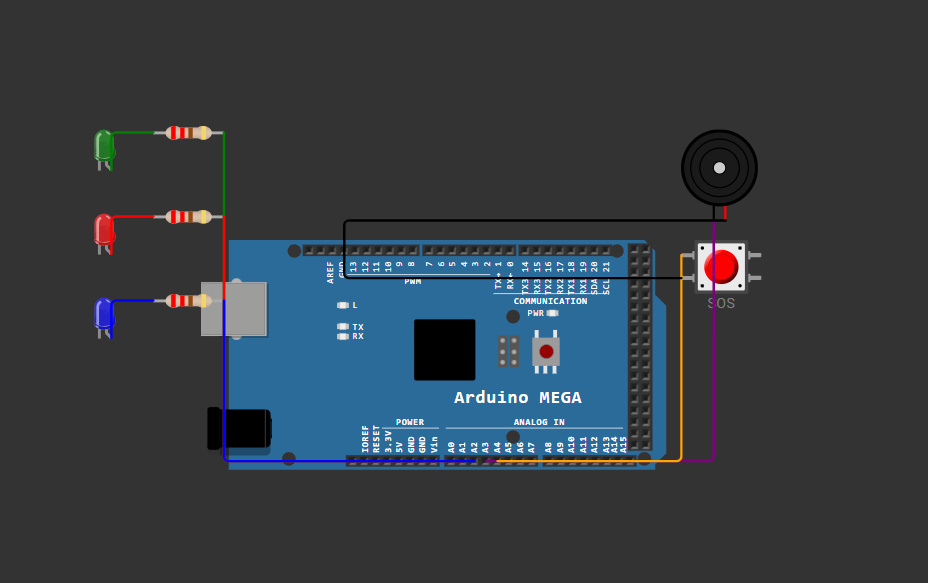

# 🚨 DisasterLink — Kit de Emergência 

> Projeto desenvolvido como parte da disciplina de Edge Computing & Computer Systems.

---

## 📌 Descrição do projeto
 
Quando uma enchente, desabamento ou incêndio acontece, a infraestrutura de comunicação cai junto, sem celular, sem internet, sem luz. Vítimas não conseguem pedir socorro, equipes de resgate não sabem aonde ir e a Defesa Civil coordena ações às cegas. Isso aconteceu no Rio Grande do Sul em 2024, onde municípios inteiros ficaram dias sem comunicação.

O **DisasterLink** é um sistema de comunicação de emergência criado para resolver exatamente esse problema. A solução completa é composta por um kit físico portátil, um painel de comando para a Defesa Civil e um aplicativo para as equipes de resgate. O kit usa rádio LoRa para receber sinais de socorro das vítimas e envia as informações via 4G ou, quando este falha, via satélite Iridium, garantindo comunicação em qualquer lugar do planeta, independente de infraestrutura terrestre.
 
---
 
## 🎯 Objetivo da solução
 
A solução foi pensada em três camadas:
 
- **Camada 1:** A vítima pede socorro por dois meios, conectando ao WiFi do kit pelo celular e preenchendo um formulário rápido, ou simplesmente apertando um botão SOS físico (com rádio LoRa, alcance de até 5km).
 
- **Camada 2:** Os dados chegam ao centro de comando pelo canal principal (4G) ou, quando este falha totalmente, pelo canal de emergência (satélite Iridium), com confirmação de recebimento em menos de 3 minutos.
 
- **Camada 3:** A Defesa Civil age através de um painel web em tempo real com o mapa de vítimas, um app offline para os resgatadores e alertas automáticos via WhatsApp para emergências médicas.
 
---
 
## 💡 O Projeto no Arduino — O que foi simulado
 
A prototipagem representa o núcleo operacional do kit físico: o momento em que o botão SOS de uma vítima é recebido, o sistema tenta o envio por 4G, falha, e aciona o satélite Iridium como fallback.
 
Os módulos reais (LoRa, GPS, modem 4G, modem Iridium) são representados no código via lógica simulada no Monitor Serial, e os componentes físicos da simulação (LEDs e buzzer) reproduzem os alertas visuais e sonoros que o operador do kit receberia em campo.

---

## 🖼️ Preview do circuito
 
[](https://wokwi.com/projects/465923138582135809)
 
> Simulação montada no **Wokwi**. O botão simula o chaveiro SOS da vítima; os LEDs e o buzzer reproduzem os alertas visuais e sonoros que o operador do kit receberia em campo.
 
🔗 [Acessar simulação no Wokwi](https://wokwi.com/projects/465923138582135809)
 
[]()
 
---
 
## 🛠️ Componentes utilizados 

| Componente | Quantidade | Pino no Arduino | Função |
|---|---|---|---|
| Arduino Uno | 1 | — | Microcontrolador principal |
| LED Verde | 1 | A0 | Indica sistema ligado e operacional |
| LED Vermelho | 1 | A1 | Pisca ao receber sinal SOS |
| LED Azul | 1 | A2 | Indica módulo LoRa ativo |
| Buzzer Passivo | 1 | A3 | Confirmação sonora do envio via satélite |
| Botão (Push Button) | 1 | A4 | Simula o chaveiro SOS da vítima |
| Resistores 220Ω | 4 | — | Proteção dos LEDs |
 
### Software
 
- **Arduino IDE** 2.x — [download](https://www.arduino.cc/en/software)
 
---
 
## ⚙️ Explicação do funcionamento
 
### Inicialização (`setup`)
 
Ao ser ligado, o Arduino configura todos os pinos, acende o **LED Verde** (sistema OK) e o **LED Azul** (módulo LoRa ativo) e exibe no Monitor Serial a confirmação de que os módulos LoRa, GPS e Satélite estão prontos para operar.
 
### Loop de monitoramento (`loop`)
 
O sistema fica em monitoramento contínuo aguardando o acionamento do botão SOS. Quando pressionado, o seguinte fluxo é executado:
 
| Etapa | O que acontece | Feedback visual/sonoro |
|---|---|---|
| **1. SOS recebido** | Sinal LoRa captado — exibe coordenadas GPS e distância da vítima | LED Vermelho pisca |
| **2. Tentativa 4G** | Sistema tenta enviar os dados pela rede celular | — |
| **3. Falha 4G** | Sem sinal na área — canal principal indisponível | — |
| **4. Envio Iridium** | Dados enviados via satélite — Defesa Civil avisada | 2 bipes no buzzer |

---

## 🔌 Estrutura do circuito
 
```
Arduino Uno
│
├── A0 ──[220Ω]──── LED Verde    (Anodo) ──── GND
├── A1 ──[220Ω]──── LED Vermelho (Anodo) ──── GND
├── A2 ──[220Ω]──── LED Azul     (Anodo) ──── GND
├── A3 ──────────── Buzzer (+)            ──── GND
└── A4 ──────────── Botão SOS             ──── GND
         (INPUT_PULLUP interno — sem resistor externo)
```
 
### Tabela de pinos
 
| Pino Arduino | Componente | Tipo |
|---|---|---|
| A0 | LED Verde | OUTPUT |
| A1 | LED Vermelho | OUTPUT |
| A2 | LED Azul | OUTPUT |
| A3 | Buzzer | OUTPUT |
| A4 | Botão SOS | INPUT_PULLUP |
 
---

## ▶️ Como executar

### **Opção A — Tinkercad**
 
1. Acesse [tinkercad.com](https://www.tinkercad.com) e faça login ou crie uma conta gratuita.
2. Clique em **"Criar"** e selecione **"Circuito"**.
3. Adicione os componentes no painel lateral: **Arduino Uno**, **3 LEDs** (verde, vermelho e azul), **3 resistores 220Ω**, **1 buzzer** e **1 botão**.
4. Conecte cada LED ao seu resistor e ligue ao pino correspondente: verde em A0, vermelho em A1, azul em A2.
5. Conecte o buzzer ao pino A3 e o botão ao pino A4, ambos com o outro terminal no GND.
6. Clique em **"Código"** e selecione o modo **"Texto"**.
7. Apague o código padrão e cole o conteúdo do arquivo `DisasterLink.ino`.
8. Clique em **"Iniciar Simulação"**.
9. Clique no botão do circuito para simular o SOS e acompanhe os alertas no painel.
    
---
 
### **Opção B — Wokwi**
 
1. Acesse [wokwi.com](https://wokwi.com) e faça login ou crie uma conta gratuita.
2. Clique em **"New Project"** e selecione **"Arduino Uno"**.
3. No painel de componentes (botão **"+"** à esquerda), adicione: **3 LEDs** (verde, vermelho e azul), **3 resistores 220Ω**, **1 buzzer** e **1 botão**.
4. Conecte cada LED ao seu resistor e ligue ao pino correspondente: verde em A0, vermelho em A1, azul em A2.
5. Conecte o buzzer ao pino A3 e o botão ao pino A4, ambos com o outro terminal no GND.
6. No editor de código, apague o conteúdo padrão e cole o conteúdo do arquivo `DisasterLink.ino`.
7. Clique em **▶ Play**.
8. Abra o **Monitor Serial** (ícone de terminal na barra inferior) para acompanhar as mensagens.
9. Clique no botão do circuito para simular o SOS e acompanhe os alertas no painel.
    
---
 
### **Opção C — Hardware físico**
 
1. Monte o circuito na protoboard conforme a tabela de pinos acima.
2. Abra o arquivo `DisasterLink.ino` na **Arduino IDE** (v1.8+ ou v2.x).
3. Selecione a placa em `Ferramentas > Placa > Arduino Uno`.
4. Selecione a porta correta em `Ferramentas > Porta`.
5. Clique em **Upload** (`Ctrl+U`).
6. Abra o **Monitor Serial** com baud rate **9600** para acompanhar os valores em tempo real.
7. Pressione o botão físico para acionar o SOS e e acompanhe os alertas no painel.

---
 
## 📁 Estrutura do repositório
 
```
DisasterLink/
├── DisasterLink.ino ← Código-fonte
├── DisasterLink.png ← Imagem do Arduino 
└── README.md ← Este documento
```
 
---

## 👩‍💻 Equipe

| Nome | RM |
|------|----|
| Caique Kenji Yafuco | 570368 |
| Guilherme Tome Nogueira | 570144 |
| Lucas de Andrade Astorini | 569119 |
| Sabrina Lopes da Silva | 571870 |
| Sofia Satomi Hagio | 569120 |
